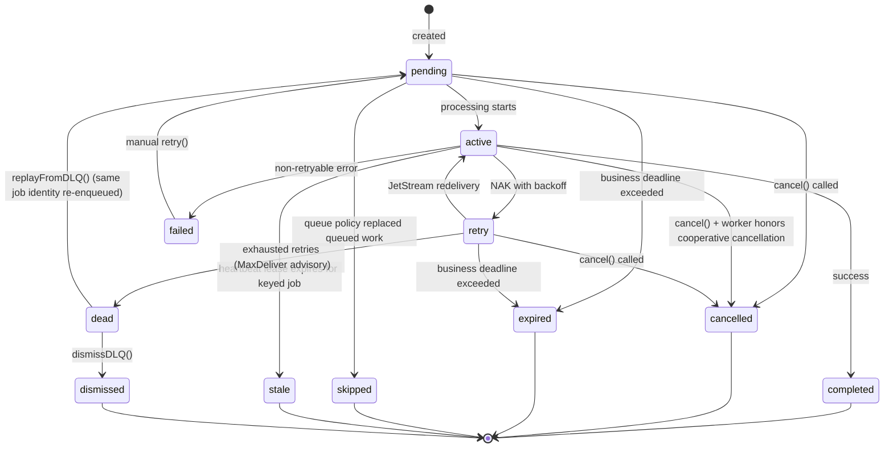

# Design: Trellis Job Management

## Prerequisites

- [../core/service-development.md](./../core/service-development.md) -
  service-author patterns and jobs vs operations boundary
- [../core/type-system-patterns.md](./../core/type-system-patterns.md) - Result,
  error, and weak-type guidance

## Context

Services need a means of:

- Running service-private background work
- Handling retries of failed work with backoff
- Projecting execution status for observability and admin tooling
- Recording internal progress for workflows that may also back caller-visible
  operations
- Allowing operators to query jobs across all services

Trellis services should follow the companion cross-cutting pattern docs
referenced above.

## Design

This document defines the Trellis jobs subsystem and its public language
surfaces:

- a service-local jobs surface for services to create and process their own jobs
- an admin jobs surface for operators to query and manage jobs across all
  services

Exact TypeScript helper signatures, Rust method signatures, generated item
inventories, SDK imports, and client member lists belong in the generated API
reference and Rustdoc under `/api`. This document defines the subsystem
invariants those APIs must preserve.

In TypeScript, the service-local runtime surface lives in `@qlever-llc/trellis`
and the standard Trellis Jobs admin RPC contract lives in
`@qlever-llc/trellis/sdk/jobs`:

- service-local jobs are exposed on connected service runtimes as `service.jobs`
- admin and operator jobs access uses the centralized `Jobs.*` RPC surface,
  typically through generated jobs SDK types or client wrappers

This document also defines the shared Trellis-owned jobs infrastructure plus a
separate Jobs admin runtime implementation for admin queries, janitor, and SQL
projection. The `trellis.jobs@v1` contract is a built-in Trellis API; it is not
owned by that runtime implementation.

Caller-visible asynchronous APIs are defined separately in
[../operations/trellis-operations.md](./../operations/trellis-operations.md).
Jobs remain service-private execution machinery.

The shared streams used by jobs are Trellis-owned runtime infrastructure.
Accepted top-level job queues are deployment authority desired state, and
reconciliation creates or binds the materialized job infrastructure and queue
bindings for jobs-enabled services. The Jobs admin runtime may host the built-in
`trellis.jobs@v1` RPCs, but it does not own or control the contract. Ordinary
services and demos should not need an extra manual `trellis.jobs@v1` install
step just to create or process jobs.

### Design Principles

1. **Stream-first architecture** — The `JOBS` JetStream stream is the source of
   truth. SQL is a disposable derived projection for queries and admin actions.
2. **Jobs admin runtime** — Implements janitor, global RPC handlers, and SQL
   projection for the built-in Jobs API. Runtime replicas may share the same
   projection database or run with one owner for projector/janitor/advisory
   loops plus RPC-only replicas.
3. **Service-local processing** — Each service processes its own jobs via its
   own consumer.
4. **Passive worker heartbeats** — Workers emit per-job-type heartbeat subjects
   for observability; any admin registry is a derived projection, not part of
   job correctness.
5. **Stream-driven observability** — Job state changes and worker heartbeats
   publish messages to the jobs subsystem stream space (these are not
   `events.v1.*` domain events).
6. **Opt-in keyed coordination** — Job queues without a declared concurrency key
   keep the historical work-queue behavior. Queues with a declared key use
   Trellis-owned coordination state to enforce per-key active limits,
   queue-depth policy, and heartbeat-based stale-job handling across service
   instances.
7. **Live updates are transient** — A queue may declare one typed `update`
   schema for at-most-once content sent only to active subscribers. These frames
   are separate from durable job lifecycle events and projections.

### Job States

| State       | Description                                          |
| ----------- | ---------------------------------------------------- |
| `pending`   | Job created, waiting to be processed                 |
| `active`    | Currently being processed                            |
| `retry`     | NAK sent, awaiting JetStream redelivery              |
| `completed` | Successfully finished                                |
| `failed`    | Processing failed, can be manually retried           |
| `cancelled` | Cancelled before completion (terminal)               |
| `expired`   | Exceeded business deadline (terminal)                |
| `skipped`   | Accepted work was skipped by runtime queue policy    |
| `stale`     | Active work lost its key lease and was superseded    |
| `dead`      | Moved to DLQ, awaiting admin replay or dismissal     |
| `dismissed` | Explicitly dismissed from DLQ by an admin (terminal) |

**State transitions:**



**Cancellation semantics:**

- `pending`/`retry`: Immediate cancellation (job never processed or won't be
  retried)
- `active`: Best-effort and cooperative. Language runtimes may expose different
  cancellation primitives to handlers, but the worker-facing semantic is the
  same: cancellation should be observed cooperatively by in-flight work.
- Worker-host shutdown is distinct from business cancellation. Shutdown should
  interrupt processing and requeue work rather than publishing a normal
  `cancelled` outcome.
- Execution-terminal states (`completed`, `failed`, `cancelled`, `expired`,
  `skipped`, `stale`, `dead`, `dismissed`): No-op for worker processing and
  cancellation. Explicit admin DLQ operations move only `dead` jobs into
  `pending` or `dismissed`.

### Storage Architecture

**Source of Truth: JetStream Stream (`JOBS`)**

- Stream: `JOBS`
- Subject families:
  - Job lifecycle: `trellis.jobs.<service>.<job-type>.<job-id>.<event>`
  - Worker heartbeats:
    `trellis.jobs.workers.<service>.<job-type>.<instance-id>.heartbeat`
- Message subjects:
  - `trellis.jobs.<service>.<job-type>.<job-id>.created` — includes full payload
  - `trellis.jobs.<service>.<job-type>.<job-id>.started`
  - `trellis.jobs.<service>.<job-type>.<job-id>.retry`
  - `trellis.jobs.<service>.<job-type>.<job-id>.progress`
  - `trellis.jobs.<service>.<job-type>.<job-id>.logged`
  - `trellis.jobs.<service>.<job-type>.<job-id>.completed`
  - `trellis.jobs.<service>.<job-type>.<job-id>.failed`
  - `trellis.jobs.<service>.<job-type>.<job-id>.cancelled`
  - `trellis.jobs.<service>.<job-type>.<job-id>.expired`
  - `trellis.jobs.<service>.<job-type>.<job-id>.skipped`
  - `trellis.jobs.<service>.<job-type>.<job-id>.stale`
  - `trellis.jobs.<service>.<job-type>.<job-id>.heartbeat`
  - `trellis.jobs.<service>.<job-type>.<job-id>.staleCompletionIgnored`
  - `trellis.jobs.<service>.<job-type>.<job-id>.retried`
  - `trellis.jobs.<service>.<job-type>.<job-id>.dead`
  - `trellis.jobs.<service>.<job-type>.<job-id>.dismissed`
  - `trellis.jobs.workers.<service>.<job-type>.<instance-id>.heartbeat` —
    passive worker-presence heartbeat
- Retention: Limits-based (configurable)

These subjects are namespaced to the jobs subsystem (`trellis.jobs.*`). They
remain raw pub/sub subjects rather than `events.v1.*` contract events.

**Subject filtering examples:**

| Pattern                                        | Description                                      |
| ---------------------------------------------- | ------------------------------------------------ |
| `trellis.jobs.>`                               | All jobs-subsystem subjects across all services  |
| `trellis.jobs.<service>.>`                     | All lifecycle events for a specific service      |
| `trellis.jobs.<service>.<job-type>.>`          | All lifecycle events for a specific job type     |
| `trellis.jobs.*.*.<job-id>.>`                  | All events for a specific job (any service/type) |
| `trellis.jobs.<service>.<job-type>.<job-id>.>` | All events for a specific job (fully qualified)  |
| `trellis.jobs.*.*.*.completed`                 | All completion events across services            |
| `trellis.jobs.workers.<service>.>`             | All worker heartbeats for a specific service     |
| `trellis.jobs.workers.<service>.<job-type>.>`  | All worker heartbeats for a specific job type    |

Job state changes and worker heartbeats are published to this stream. The stream
is append-only and replayable. The `.created` event contains the full job
payload and Trellis-owned job context, enabling stream replay to reconstruct job
state and preserve request/trace correlation.

Typed job updates are not published to `JOBS`. They use a private Core NATS
subject outside the jobs lifecycle subject family and are not persisted,
replayed, projected into SQL, exposed through jobs admin, or sent to Event Log.

**Work Queue: JetStream Stream (`JOBS_WORK`)**

- Stream: `JOBS_WORK`
- **Sources from `JOBS`** — automatically populated via stream sourcing (see
  Provisioning Model)
- Subject pattern: `trellis.work.<service>.<job-type>`
- Consumer: Per job-type durable consumer (allows different BackOff/AckWait per
  type)
- Retention: WorkQueue policy

When a service calls `service.jobs.<queue>.create()`, the runtime publishes a
`.created` event to `JOBS`. The `JOBS_WORK` stream is configured to source
`.created` and `.retried` events from `JOBS` with a subject transform,
automatically populating the work queue. This keeps initial enqueue and manual
retry stream-first and replayable.

Every lifecycle event includes `context` with `requestId`, `traceId`,
`traceparent`, and optional `tracestate`. Job creation inherits active trace
context when one exists and otherwise creates a fresh W3C `traceparent`; jobs
are never created without trace context. Lifecycle publishes also set matching
NATS headers: `request-id`, `traceparent`, and `tracestate` when present.

**Consumer configuration (per job-type):**

```
MaxDeliver: 5
BackOff: 5s, 30s, 2m, 10m, 30m
AckPolicy: Explicit
AckWait: 5m (must exceed expected job duration)
```

**Advisory Stream (`JOBS_ADVISORIES`)**

- Stream: `JOBS_ADVISORIES`
- Subject: `$JS.EVENT.ADVISORY.CONSUMER.MAX_DELIVERIES.JOBS_WORK.>`
- Purpose: Durable capture of max-delivery advisories for reliable failure
  detection

When a work message exhausts `MaxDeliver`, NATS emits an advisory. By capturing
these in a stream, the `jobs` service can reliably detect exhausted jobs even if
it was temporarily unavailable.

**Jobs Admin Projection: SQLite**

The shared jobs subsystem stores query state in an internal SQLite projection
owned by the Jobs admin runtime.

- Default path: `/var/lib/trellis/jobs.sqlite`
- Override: `TRELLIS_JOBS_DB_PATH`
- Tables:
  - `jobs_projection` for current job state and query fields
  - `worker_presence_projection` for latest worker heartbeat state
  - `projection_metadata` for projection bookkeeping

The jobs projection is a strict view of the event stream. Job state in SQLite
changes only by projecting job events from `JOBS`; neither the Jobs admin
runtime nor an admin RPC mutates projected job state directly. Admin mutations
publish real lifecycle events and then observe those events through the
projection.

Worker presence is also an internal SQL projection. Workers emit passive
heartbeat subjects; the Jobs admin runtime stores the latest heartbeat per
service/job-type/instance and applies freshness filtering at query time.
Ordinary services do not bind to or write any admin projection storage.

### Provisioning Model

Shared jobs infrastructure is Trellis-owned runtime state. Accepted job queues
are deployment authority desired state. Trellis reconciles the shared streams,
queue bindings, and per-service materialized authority for jobs-enabled
environments rather than requiring a separate manual jobs install step or
first-bootstrap side effect.

- normal services declare top-level `jobs` to participate in jobs processing
  without owning the shared stream topology directly
- Trellis owns the shared streams needed by the jobs subsystem
- a separate jobs admin runtime may still implement centralized queries, janitor
  work, and SQL projections for the built-in Jobs API, but ordinary
  service-local workers do not depend on a manual jobs service deployment to
  start
- reconciliation creates or binds the shared jobs resources before jobs-enabled
  services start
- the `jobs` service and service-local workers create only dynamic per-job-type
  consumers at runtime
- the runtime should consume those bindings, rather than hard-coding an
  imperative infrastructure setup path
- resolved runtime bindings may still include internal work-stream details
  needed by the host runtime, but they do not expose admin projection storage to
  ordinary services. Public service-author APIs should use
  `service.jobs.<queue>.handle(...)`, `service.wait()`, and `JobRef` helpers
  rather than runtime stream bindings directly

This document depends on the contract model in
`../contracts/trellis-api-participants.md` supporting top-level jobs,
binding-driven resource access, and runtime-owned JetStream infrastructure. Jobs
streams and stream source transforms are Trellis-owned runtime details, not
service-declared contract resources.

Normal consuming service contracts should declare top-level `jobs`. The JSON
examples below show the resolved JetStream configuration the jobs runtime
expects after binding. Reconciliation materializes these shared resources so
service-local workers can rely on the bindings without a separate infrastructure
install step.

Queue change classification:

- adding a queue is an approval-required authority update
- increasing `maxDeliver`, increasing `ackWaitMs`, extending backoff, enabling
  progress/logs/DLQ, or increasing `concurrency` is usually an auto-applied
  authority update
- adding `keyConcurrency.key` to a previously unkeyed queue, reducing
  `keyConcurrency.maxActive`, reducing `queue.maxQueuedPerKey`, or changing
  `queue.whenFull` to a stricter policy is an authority migration because it can
  reject work that would previously enqueue or run
- increasing `keyConcurrency.maxActive`, increasing `queue.maxQueuedPerKey`, or
  relaxing `queue.whenFull` from `reject` to `coalesce` or `replace-oldest` is
  usually an auto-applied authority update
- removing or renaming a queue, changing payload or result schema in a way that
  may reject existing jobs, reducing `maxDeliver` or `ackWaitMs`, shortening
  backoff, disabling DLQ for a queue with outstanding failures, or changing
  delivery settings in a way that may skip or duplicate work is an authority
  migration

Trellis jobs require `nats-server` 2.10.0 or newer. This is the runtime floor
for JetStream source subject transforms and filtered consumer create API
permissions; older durable consumer-create subjects are not part of the v1 jobs
permission model.

### Canonical Worker Runtime Flow

All Trellis language runtimes MUST use the same service-local jobs worker flow.
Library-specific JetStream helper behavior is not a runtime contract and must
not add extra permissions or alter worker semantics.

For each bound queue, the connected service runtime MUST:

- validate the resolved queue binding and configured concurrency before starting
  worker tasks
- ensure the per-queue durable consumer directly against the bound `workStream`
  and queue `consumerName` using the NATS 2.10 filtered consumer create API
- avoid preflighting or opening `JOBS_WORK` through stream-info APIs during
  service-local worker startup
- fetch direct consumer info by `workStream` and `consumerName` only as the
  fallback for an existing compatible consumer
- fail worker startup synchronously if the durable consumer cannot be created or
  attached
- consume work messages from the ensured consumer handle
- before processing a work item, read the latest lifecycle event from `JOBS`
  with JetStream direct get by fully qualified lifecycle subject
- ack without processing when the latest lifecycle event is terminal
- for keyed queues, derive the key from the payload and acquire an active slot
  in `JOBS_KEYS` before publishing `started`; if the key is at its active limit,
  the worker MUST leave the message unprocessed and request redelivery rather
  than running duplicate active work
- for keyed queues, run automatic heartbeat renewal while the handler is active
  and release the active slot only when the job still owns the slot token
- if per-message processing or terminal cleanup fails after work is accepted,
  request redelivery for that message, best-effort release any owned keyed
  active slot, and keep the queue worker running
- subscribe to the queue cancellation subject for live cooperative cancellation

This canonical path is intentionally language-neutral. TypeScript, Rust, and any
future runtime must converge on this flow even when their underlying NATS client
libraries expose different helper APIs.

The service-local jobs permission set therefore includes the concrete subjects
needed for this canonical flow: filtered consumer create/info for the bound work
stream, pull-message and ack subjects for that consumer, direct get on the
`JOBS` stream for lifecycle reads, service-local lifecycle publish/subscribe
subjects, and service-local worker heartbeat subjects. It does not include broad
stream management, `JOBS_WORK` stream-info preflight, or legacy
durable-consumer-create subjects for ordinary services.

Trellis-created Jobs streams use the resolved JetStream replica count for the
deployment. Operators may set `nats.jetstream.replicas` explicitly. When it is
omitted, the Trellis runtime probes NATS through the system account JSZ service
and chooses `3` only when at least three current JetStream metadata peers are
visible; otherwise it uses `1`. The examples below use `3` to show the
recommended production shape.

Resolved service bindings may still include internal runtime-generated work
stream details such as `JOBS_WORK`, but ordinary service code should treat those
as Trellis internals rather than as public contract-authored stream aliases.
Jobs admin projection storage is internal to the Jobs admin runtime and is not
part of the service-visible jobs binding.

**Stream: `JOBS`**

```json
{
  "name": "JOBS",
  "subjects": ["trellis.jobs.>"],
  "retention": "limits",
  "max_msgs": -1,
  "max_bytes": -1,
  "max_age": 0,
  "storage": "file",
  "num_replicas": 3,
  "discard": "old"
}
```

**Stream: `JOBS_WORK`**

```json
{
  "name": "JOBS_WORK",
  "subjects": ["trellis.work.>"],
  "retention": "workqueue",
  "storage": "file",
  "num_replicas": 3,
  "sources": [
    {
      "name": "JOBS",
      "filter_subject": "trellis.jobs.*.*.*.created",
      "subject_transform_dest": "trellis.work.$1.$2"
    },
    {
      "name": "JOBS",
      "filter_subject": "trellis.jobs.*.*.*.retried",
      "subject_transform_dest": "trellis.work.$1.$2"
    }
  ]
}
```

The `sources` configuration automatically replicates `.created` and `.retried`
events from `JOBS` into `JOBS_WORK` with a subject transform:
`trellis.jobs.<service>.<job-type>.<job-id>.<event>` →
`trellis.work.<service>.<job-type>`.

**Key Coordination Bucket (`JOBS_KEYS`)**

- Bucket: `JOBS_KEYS`
- Key pattern: `<service>/<job-type>/<key-hash>`
- Purpose: opt-in keyed concurrency, per-key queue-depth policy, and active-job
  heartbeat leases
- Writes: service-local jobs runtime only, using compare-and-set revisions
- Reads: service-local jobs runtime and Jobs admin runtime projection/query
  paths

`JOBS_KEYS` is Trellis-owned runtime infrastructure. It is not service-owned
domain state and is not a replacement for service-local idempotency, checkpoint
commits, or database ownership checks. Services whose database is the durable
correctness boundary SHOULD keep idempotent commits and MAY keep local ownership
guards even when Trellis prevents duplicate active work.

One key-state value has this logical shape:

```typescript
type JobKeyState = {
  version: 1;
  service: string;
  jobType: string;
  key: string;
  keyHash: string;
  maxActive: number;
  maxQueuedPerKey?: number;
  active: Array<{
    jobId: string;
    slotToken: string;
    instanceId: string;
    startedAt: string;
    heartbeatAt: string;
    leaseExpiresAt: string;
    tries: number;
  }>;
  queued: Array<{
    jobId: string;
    createdAt: string;
    requestId: string;
  }>;
  staleTakeoverCount: number;
  updatedAt: string;
};
```

The stored key value is derived from the job contract's `keyConcurrency.key`
template. Human-readable keys are carried in lifecycle events and admin
projections; high-cardinality runtime storage uses a stable hash segment.

**Stream: `JOBS_ADVISORIES`**

```json
{
  "name": "JOBS_ADVISORIES",
  "subjects": ["$JS.EVENT.ADVISORY.CONSUMER.MAX_DELIVERIES.JOBS_WORK.>"],
  "retention": "limits",
  "max_age": 604800000000000,
  "storage": "file",
  "num_replicas": 1
}
```

**KV Bucket: `JOBS_KEYS`**

```json
{
  "bucket": "JOBS_KEYS",
  "history": 1,
  "storage": "file",
  "num_replicas": 3
}
```

Trellis reconciles this bucket only when jobs infrastructure is enabled. Keyed
queues depend on this bucket for correctness; unkeyed queues do not read or
write it.

**Consumer: Per job-type (created dynamically)**

Each service creates a durable consumer for its job types:

```json
{
  "durable_name": "<service>-<job-type>",
  "filter_subject": "trellis.work.<service>.<job-type>",
  "ack_policy": "explicit",
  "ack_wait": 300000000000,
  "max_deliver": 5,
  "backoff": [
    5000000000,
    30000000000,
    120000000000,
    600000000000,
    1800000000000
  ]
}
```

**Scaling note:** For v1, the projector uses a single consumer. If horizontal
scaling is needed, NATS `partition()` function enables deterministic
partitioning by job-id for parallel projection while maintaining per-job
ordering.

### Jobs Service

A dedicated `jobs` service provides observability and management. It is **not
required for job processing**—services can create and process jobs
independently. The `jobs` service adds:

1. **SQL Projection** — Consumes `JOBS` stream via durable consumer and updates
   the internal SQLite query projection
2. **Worker Presence Projection** — Passively consumes worker heartbeat subjects
   and derives admin-facing live-worker views in SQLite
3. **Janitor** — Enforces business `deadline` expiry (not AckWait—JetStream
   handles redelivery)
4. **Advisory Consumer** — Consumes `JOBS_ADVISORIES` and maps exhausted
   deliveries to `.dead`
5. **Global RPCs and feed** — health, service listing, server-side workbench
   query/inspect, keyed state, cancel/retry, DLQ management, and workbench
   invalidation feed
6. **Keyed concurrency observability** — Projects active key, queued depth by
   key, heartbeat age, lease expiry, stale takeover count, and queue-policy
   rejection/coalescing/replacement reasons for keyed queues

The jobs admin runtime is stateless with respect to source-of-truth job state.
If it's unavailable, job processing continues normally; only UI visibility and
deadline enforcement pause until it recovers and rebuilds or catches up the SQL
projection.

### Worker Heartbeats

Workers may publish passive heartbeat events per service instance and job type:

```typescript
type WorkerHeartbeat = {
  service: string;
  jobType: string;
  instanceId: string;
  concurrency?: number;
  version?: string;
  timestamp: string;
};
```

**Subject:** `trellis.jobs.workers.<service>.<job-type>.<instance-id>.heartbeat`

- Heartbeats are a sibling subject family inside the jobs subsystem, distinct
  from per-job lifecycle subjects.
- Emitting heartbeats is optional for job correctness. Jobs continue to run even
  if heartbeats are absent or the `jobs` service is not deployed.
- The Jobs admin runtime projects heartbeats into a durable, freshness-filtered
  live-worker view for admin screens and service summaries.
- `listServices()` and related admin views aggregate that derived
  worker-presence projection rather than reading direct service-written registry
  state.

### Typed Live Updates

A top-level job queue MAY declare one optional update schema:

```typescript
jobs: {
  syncTickets: {
    payload: { schema: "SyncTicketsPayload" },
    update: { schema: "SyncTicketsUpdate" },
    result: { schema: "SyncTicketsResult" },
  },
}
```

`progress` remains low-frequency durable telemetry projected for operators.
`update` is typed live-only content emitted by an active handler with TypeScript
`job.emitUpdate(...)` or Rust `ActiveJob::emit_update::<D>(...)`. Service-local
consumers subscribe with TypeScript `JobRef.updates()` or
`service.jobs.<queue>.updates(jobId)`, or Rust
`NatsJobWaiter::updates::<D>(jobId)`. Payloads SHOULD be cumulative because late
subscribers and disconnected subscribers may miss frames. The terminal job
result or failure is authoritative.

Each frame carries its job attempt and an attempt-local sequence. Runtime
subscriptions discard older attempts and duplicate or out-of-order sequences.
TypeScript subscriptions clean up on `unsubscribe()`, abort, or iterator close;
Rust `NatsJobWaiter` streams also end when terminal lifecycle is observed. This
filtering and cleanup do not make updates replayable.

SQL-outbox callers that need updates MUST preallocate the job id and subscribe
with the queue-level `updates(jobId)` API before the committed intent is
dispatched. A `JobRef` created only after dispatch may subscribe too late for
early frames.

### Job Schema

```typescript
type JobWire = {
  id: string;
  service: string;
  type: string;
  state: JobState;

  payload: unknown;
  result?: unknown;

  createdAt: string;
  updatedAt: string;
  startedAt?: string;
  completedAt?: string;

  tries: number;
  maxTries: number;
  lastError?: string;
  errorDetail?: JobErrorDetail;

  deadline?: string;

  concurrency?: {
    key: string;
    keyHash: string;
    slotToken?: string;
    heartbeatAt?: string;
    leaseExpiresAt?: string;
    staleTakeoverCount?: number;
  };

  queuePolicy?: {
    outcome?: "accepted" | "rejected" | "coalesced" | "replaced";
    reason?: string;
    existingJobId?: string;
    replacedJobId?: string;
  };

  progress?: {
    step?: string;
    message?: string;
    current?: number;
    total?: number;
  };

  logs?: JobLogEntry[];

  trigger?: JobTrigger;
  lineage?: JobLineage;
  waitingOn?: JobWaitEdge[];
};

type JobLogEntry = {
  timestamp: string;
  level: "info" | "warn" | "error";
  message: string;
};

type JobErrorDetail = {
  message: string;
  type?: string;
  stack?: string;
  causes?: JobErrorDetail[];
  fingerprint: string;
  firstSeen?: string;
  occurrenceCount?: number;
};

type JobTrigger = {
  kind:
    | "schedule"
    | "operation"
    | "rpc"
    | "event"
    | "manualReplay"
    | "serviceCode"
    | "parentJob";
  id?: string;
  subject?: string;
  operationId?: string;
  parentJobId?: string;
  traceId?: string;
  requestId?: string;
};

type JobLineage = {
  parentJobId?: string;
  rootJobId?: string;
  operationId?: string;
  relatedKeys?: string[];
};

type JobWaitTarget = {
  kind: "job" | "operation" | "external";
  id?: string;
  operationId?: string;
  service?: string;
  type?: string;
  label?: string;
  system?: string;
  operation?: string;
  key?: string;
};

type JobWaitEdge = {
  id: string;
  target: JobWaitTarget;
  startedAt: string;
  label?: string;
};

type JobState =
  | "pending"
  | "active"
  | "retry"
  | "completed"
  | "failed"
  | "cancelled"
  | "expired"
  | "skipped"
  | "stale"
  | "dead"
  | "dismissed";
```

`unknown` in this schema is a wire-model concern, not the intended public
service-author API. Public Rust and TypeScript jobs APIs MUST expose typed
per-job-type handles and MUST NOT require callers to work directly with
`unknown`, `any`, or `serde_json::Value` for normal job creation or handling.

### Lifecycle Events

Job state changes are published to the `JOBS` stream:

**Subject:** `trellis.jobs.<service>.<job-type>.<job-id>.<event-type>`

**Event types:**

- `created` — Job enqueued (includes full payload for stream reconstruction)
- `started` — Processing began
- `retry` — Worker requested redelivery via NAK/backoff
- `progress` — Progress update (structured: step/message/current/total, all
  optional)
- `waiting` — Active handler began waiting on another job, operation, or
  explicitly declared external async work; job state remains `active`
- `resumed` — Active handler stopped waiting on the matching wait edge; job
  state remains `active`
- `logged` — Log entry added (contains only new entries; the SQL projection
  aggregates the current log view)
- `completed` — Successfully finished (includes result)
- `failed` — Non-retryable failure
- `cancelled` — Job was cancelled
- `expired` — Business deadline exceeded
- `skipped` — Queued work was skipped because a queue policy replaced it before
  execution
- `stale` — Active keyed work lost its heartbeat lease and no longer owns the
  key slot
- `heartbeat` — Active keyed work renewed its heartbeat lease (runtimes MAY
  throttle or omit this lifecycle event when the KV lease remains the freshness
  source of truth)
- `staleCompletionIgnored` — A stale worker attempted to complete, fail, or
  retry after losing the key slot; the normal terminal event was intentionally
  ignored
- `retried` — Manual retry triggered
- `dead` — Marked dead after exhausted deliveries via advisory handling
- `dismissed` — Explicitly dismissed from DLQ by an admin

**Payload:**

```typescript
type JobEventWire = {
  jobId: string;
  context: {
    requestId: string;
    traceId: string;
    traceparent: string;
    tracestate?: string;
  };
  service: string;
  jobType: string;
  eventType: string;
  state: JobState;
  previousState?: JobState;
  tries: number;
  error?: string;
  errorDetail?: JobErrorDetail;
  progress?: {
    step?: string;
    message?: string;
    current?: number;
    total?: number;
  };
  logs?: JobLogEntry[];
  payload?: unknown;
  result?: unknown;
  deadline?: string;
  concurrency?: {
    key: string;
    keyHash: string;
    slotToken?: string;
    heartbeatAt?: string;
    leaseExpiresAt?: string;
    staleTakeoverCount?: number;
  };
  queuePolicy?: {
    outcome?: "accepted" | "rejected" | "coalesced" | "replaced";
    reason?: string;
    existingJobId?: string;
    replacedJobId?: string;
  };
  trigger?: JobTrigger;
  lineage?: JobLineage;
  waitEdge?: JobWaitEdge;
  admin?: {
    reason?: string;
    actor?: string;
  };
  timestamp: string;
};
```

The `payload` field is **required** on `.created` events and enables full job
reconstruction from stream replay. It may be omitted on subsequent events to
reduce message size. The `context` field is required on all lifecycle events and
remains stable for the job across `created`, worker transitions, admin
mutations, janitor expiry, advisory dead-letter mapping, and replay/dismissal.
`errorDetail`, `trigger`, `lineage`, and admin metadata are optional event
evidence. When a handler only supplies an error string, the runtime/projection
derives a fallback detail with a stable fingerprint and aggregate occurrence
count. Job creation defaults to `trigger.kind = "serviceCode"`; manual DLQ
replay uses `manualReplay`; child jobs created from a job handler carry parent
job lineage and context. Admin mutation `reason` values are carried in lifecycle
event admin metadata and shown in the inspection timeline.

Worker heartbeat subjects are part of the jobs subsystem subject space but are
not job lifecycle events. They use the
`trellis.jobs.workers.<service>.<job-type>.<instance-id>.heartbeat` subject
shape and carry a `WorkerHeartbeat` payload for passive observability.

### Retry Policy

Retry timing handled by NATS consumer `BackOff` configuration:

```typescript
type RetryConfig = {
  maxDeliver: number;
  backoff: number[];
  ackWait: number;
};

const defaultRetryConfig: RetryConfig = {
  maxDeliver: 5,
  backoff: [5000, 30000, 120000, 600000, 1800000],
  ackWait: 300000, // 5 minutes
};
```

**Long-running jobs:** If job duration may exceed `ackWait`, the handler must
call `job.heartbeat()` to extend the ack deadline (sends `inProgress()` to
NATS).

For keyed queues, heartbeat also renews the active key lease in `JOBS_KEYS`.
Runtimes SHOULD start an automatic heartbeat loop while a keyed handler is
running. Explicit handler heartbeats remain useful around long blocking phases
and MUST renew both the JetStream ack deadline and the key lease.

### Keyed Concurrency And Queue Depth

Top-level job queues MAY declare an opt-in keyed concurrency policy. Unkeyed
jobs keep the current behavior and do not consult `JOBS_KEYS`.

```typescript
type JobKeyConcurrencyDescriptor = {
  key: string[];
  maxActive?: number;
  heartbeatIntervalMs?: number;
  heartbeatTtlMs?: number;
  stalePolicy?: "fail-stale" | "block";
};

type JobQueueDepthDescriptor = {
  maxQueuedPerKey?: number;
  whenFull?: "reject" | "coalesce" | "replace-oldest";
};
```

Example:

```typescript
syncTickets: {
  payload: SyncJobPayload,
  concurrency: 4,
  keyConcurrency: {
    key: ["zendesk", "/origin", "tickets"],
    maxActive: 1,
  },
  queue: {
    maxQueuedPerKey: 1,
    whenFull: "reject",
  },
}
```

Rules:

- `concurrency` remains the existing per-queue worker-count setting. Keyed
  active-job limits use the separate `keyConcurrency` object so adding keyed
  concurrency is not a breaking change to the existing manifest field.
- `keyConcurrency.key` is an ordered template of string constants and JSON
  Pointers into the job payload. Pointers MUST resolve to scalar
  string/number/boolean values after payload validation. The runtime joins
  template segments into the human-readable key and stores a stable hash for
  runtime coordination.
- `keyConcurrency.maxActive` defaults to `1`. The runtime enforces this limit
  across all service instances for the same service/job-type/key.
- `keyConcurrency.heartbeatTtlMs` defaults to a conservative value derived from
  the queue ack settings. It MUST exceed `heartbeatIntervalMs` and SHOULD be
  long enough to tolerate expected scheduling jitter.
- `keyConcurrency.stalePolicy` defaults to `"fail-stale"`. When a heartbeat
  lease expires, the runtime records the old active job as `stale` before
  another job may acquire the slot. `"block"` keeps later jobs waiting until an
  admin or the original worker releases the key.
- `queue.maxQueuedPerKey` defaults to `0` when `keyConcurrency` is present. This
  means a duplicate create while the key is active fails by default instead of
  building an implicit backlog.
- `queue.whenFull` defaults to `"reject"`. `"coalesce"` and `"replace-oldest"`
  are explicit opt-ins for scheduler or SyncNow-style work where callers want
  compression or supersession.

Create semantics:

- `create(payload)` remains the strict API: it returns a new `JobRef` when a new
  job is accepted, or a typed runtime error when active or queued limits reject
  the request.
- `submit(payload)` is the richer policy-aware API for services that want to
  inspect queue policy outcomes. It returns one of `accepted`, `rejected`,
  `coalesced`, or `replaced`.
- `coalesce` MUST NOT create a new job. It returns the existing active or queued
  job identity and publishes no `created` event for the new request.
- `replace-oldest` MAY only replace queued jobs for the same key. It MUST NOT
  replace an active job. The runtime emits `skipped` for the replaced queued job
  and `created` for the replacement.

Operation compatibility:

- Operations may create internal jobs and follow only the jobs they created.
- If `create` rejects due to keyed queue policy, the operation should translate
  the typed rejection into caller-visible progress or a terminal operation
  error.
- If an operation intentionally uses `submit` and receives `coalesced`, it
  should normally report that work is already queued or running rather than
  attaching to another caller's internal job. A service may implement shared
  progress only through its own operation-state model.

Safety invariant: keyed concurrency prevents duplicate active work in Trellis,
but it is not the durable domain correctness boundary. Services with checkpoint
or service-owned database state SHOULD still perform idempotent commits and MAY
retain DB-local ownership checks.

### Server Library API

The server-side jobs runtime should provide:

- create jobs against binding-derived queue configuration
- process jobs from service-local work subjects
- publish lifecycle events with the state model defined in this document
- expose a worker-facing active-job handle for progress, logs, and long-running
  work hooks such as heartbeat / in-progress acknowledgement
- expose a cooperative cancellation primitive to in-flight handlers
- optionally publish per-job-type worker heartbeat subjects for observability

Public runtime rules:

- jobs are service-private execution primitives and are not caller-visible async
  contracts; use operations when a caller needs a durable public contract for
  observing, waiting on, or cancelling work
- service-local job APIs and centralized admin RPC APIs are deliberately
  separate surfaces. The service-local API creates and handles a service's own
  jobs; the admin API observes and operates on jobs across services through the
  built-in `Jobs.*` RPC contract
- service-author APIs SHOULD be per-job-type rather than raw stringly queue
  dispatch
- generated service runtimes MUST expose typed per-job generated methods or
  properties for declared jobs, derived from the contract's top-level jobs map
  rather than from raw resources
- `create(...)` SHOULD return a typed `JobRef`, not a projected job snapshot
- for keyed queues, `create(...)` remains the strict create API and returns a
  typed expected failure when runtime queue policy prevents a new job from being
  accepted; `submit(...)` SHOULD be available as an additive API for callers
  that want to inspect `accepted` / `rejected` / `coalesced` / `replaced`
  outcomes
- `JobRef.wait()` is valid as an internal service primitive, but jobs are still
  service-private and are not the public async API for ordinary callers
- active job waits are represented as `active` jobs with optional `waitingOn`
  edges, not as a separate blocked state. Runtime-owned waits on Trellis jobs
  and operations SHOULD emit `waiting`/`resumed` automatically when the runtime
  has active-job context
- handlers SHOULD wrap long external async calls in the active job wait helper
  so operators can see the external system, operation, and safe correlation key;
  short awaits do not need annotation
- public TypeScript jobs APIs MUST use `Result` / `AsyncResult` for expected
  failures rather than exception-oriented `requestOrThrow` wrappers
- Rust jobs APIs return Rust `Result` values directly and should not model
  expected failures with panics
- public jobs APIs MUST NOT expose `unknown`, `any`, or `serde_json::Value`
  except in explicit raw wire-model types
- connected service runtimes SHOULD expose jobs through a higher-level facade
  such as `service.jobs`; normal service code SHOULD NOT manually assemble
  runtime bindings or call conversion helpers such as
  `jobsRuntimeBindingFromCoreBinding(...)`
- raw binding conversion helpers are bootstrap internals and SHOULD NOT be the
  normal public service-author entrypoint
- active job handles expose typed payloads plus service-private execution
  controls such as heartbeat/in-progress acknowledgement, progress publication,
  log publication, cooperative cancellation checks, and redelivery metadata
- queues with a declared update schema expose typed active-job emission plus
  `JobRef` and known-job-id subscription helpers; subscriptions are live-only
  and must be cleaned up when no longer consumed
- active job handles expose immutable job context so handlers can include
  `requestId` and trace identifiers in logs, child work, and domain outputs when
  appropriate
- active job handles for keyed queues expose the active key and heartbeat status
  for observability, but handlers MUST NOT mutate Trellis key coordination state
  directly
- duplicate handler registration for the same service-local job type is a
  bootstrap-time programming error; runtimes SHOULD fail fast rather than racing
  multiple handlers on one queue
- worker-loop startup, binding resolution, and shutdown belong to the connected
  service lifecycle; application code registers handlers and starts or waits on
  the service instead of manually owning worker bindings on the normal public
  path
- a generic string-based queue lookup helper, if present, is a low-level escape
  hatch and MUST NOT be the primary public service-author API

When the service uses SQL outbox, the transaction context also exposes
`job.<queue>.create(payload)` and `job.<queue>.submit(payload)` for
atomic-with-SQL job submission intents. The actual job admission and lifecycle
publish happen asynchronously after the SQL transaction commits.

Language runtimes may realize this with different concrete APIs as long as they
preserve the normative behavior and public API constraints defined in this
document.

**Schema validation:** Payloads should be validated before handler execution.
Invalid payloads should fail immediately rather than redelivering poison work
indefinitely.

**Idempotency:** Workers should use `msg.info.redeliveryCount` (provided by
JetStream) to detect redeliveries and implement idempotent handling where
necessary.

For exact service-local TypeScript APIs, use the generated API reference under
`/api`. For Rust jobs crates, use published Rustdoc where linked from `/api`; if
a crate is still listed as pending there, generate Rustdoc locally from the
crate source.

### Client Library API

The client-side admin jobs surface should provide operator query and admin
helpers over the centralized jobs RPC surface.

Admin client rules:

- the admin client is an operator surface, not a normal end-user application
  surface
- admin and operator access is an observability and operations boundary, not a
  service-author execution surface
- public TypeScript admin helpers MUST follow Trellis `Result` conventions
  rather than throwing for expected remote or validation failures
- centralized jobs queries and mutations SHOULD be generated-contract-aligned
  wrappers over `trellis.jobs@v1` exposed through generated SDK modules or typed
  request helpers rather than handwritten cast-heavy adapters
- admin APIs MAY return wire-shaped unknown/JSON payload and result fields
  because they cross service boundaries and inspect jobs that are not statically
  typed in the caller
- connected clients MUST NOT expose a primary generic jobs lookup helper for
  admin queries; admin access stays on the normal generated contract RPC surface
- generated SDK request and response types are preferred over handwritten casts
  or adapters

The required v1 surface is:

- list services and observed worker presence
- health check for the jobs admin service
- server-side workbench query through `Jobs.Query`, including safe full-text
  search, filtering, sorting, grouping, and stats
- single-job inspection through `Jobs.Inspect`, including the current job,
  timeline, attempts, related jobs, errors, trigger, and lineage
- keyed concurrency state through `Jobs.GetKey`
- cancel and retry eligible jobs, with optional admin reasons
- list DLQ jobs, replay DLQ jobs, and dismiss DLQ jobs
- watch workbench invalidations through `Jobs.Watch`

`Jobs.List` and `Jobs.Get` are not part of the clean-break Jobs admin surface.
Workbench callers use `Jobs.Query`; detail and timeline callers use
`Jobs.Inspect`. Jobs watch APIs are admin and observability helpers only.
Caller-visible async workflows MUST use operations rather than direct jobs watch
APIs.

For exact admin TypeScript APIs, use the generated API reference under `/api`.
For Rust jobs crates, use published Rustdoc where linked from `/api`; if a crate
is still listed as pending there, generate Rustdoc locally from the crate
source.

### RPC Endpoints

All job RPCs are centralized in the Jobs admin service. The service reads from
derived SQL projections for job state and worker presence, then publishes
administrative events or commands to the appropriate jobs subjects. It does not
mutate projected job state directly.

| RPC                 | Input                                                           | Output                      | Description                                |
| ------------------- | --------------------------------------------------------------- | --------------------------- | ------------------------------------------ |
| `Jobs.ListServices` | `{ offset?: number; limit: number }`                            | `PageResponse<ServiceInfo>` | List services and observed worker presence |
| `Jobs.Query`        | workbench filters/search/sort/group/page                        | workbench rows/groups/stats | Query jobs for admin workbenches           |
| `Jobs.Inspect`      | `{ id }`                                                        | inspection payload          | Get job, timeline, attempts, and relations |
| `Jobs.GetKey`       | `{ service, type, key }`                                        | key status payload          | Inspect keyed concurrency state            |
| `Jobs.Retry`        | `{ id, reason? }`                                               | `{ job: Job }`              | Manually retry an eligible job             |
| `Jobs.Cancel`       | `{ id, reason? }`                                               | `{ job: Job }`              | Request cooperative cancellation           |
| `Jobs.ListDLQ`      | `Omit<JobFilter, "state"> & { offset?: number; limit: number }` | `PageResponse<Job>`         | List dead letter jobs (`dead` only)        |
| `Jobs.ReplayDLQ`    | `{ id, reason? }`                                               | `{ job: Job }`              | Replay job from DLQ                        |
| `Jobs.DismissDLQ`   | `{ id, reason? }`                                               | `{ job: Job }`              | Dismiss dead-letter job                    |

| Feed         | Input                | Frames                                                         | Description                           |
| ------------ | -------------------- | -------------------------------------------------------------- | ------------------------------------- |
| `Jobs.Watch` | `{ jobId?, query? }` | `ready`, `jobChanged`, `jobInspectChanged`, `queryInvalidated` | Invalidate workbench/inspection views |

`Jobs.Query` performs server-side search, sort, grouping, and stats for the
admin workbench. Full-text search indexes safe fields only: identifiers,
service/type/state, request and trace context, queue key/policy text,
progress/log/error text. Payload and result bodies are not full-text indexed by
default.

List-style RPCs use the standard live offset page shape. Requests are
`{ offset?: number; limit: number }` plus documented filters. Responses are
`{ entries, count, offset, limit, nextOffset? }`. This is live offset
pagination, not snapshot or cursor pagination: concurrent job updates can change
which rows appear at later offsets.

Production service-local runtimes generate Trellis-controlled ULID job ids.
Query filters can still narrow by service and job type, but single-job reads and
mutations identify the job by `id` only. A missing id returns the declared
`NotFoundError`; invalid filters, including invalid RFC3339 `since` timestamps,
or invalid state transitions return the declared `ValidationError`.

`Jobs.Watch` is an invalidation feed, not a precise row-delta protocol. It emits
a `ready` frame and changed/invalidated frames; UIs rerun `Jobs.Query` or
`Jobs.Inspect` when their current view is invalidated.

`Jobs.Cancel` is the only stop primitive. Pending and retry jobs cancel
immediately; active jobs observe cancellation cooperatively in the worker. There
is intentionally no `Jobs.Kill`, `Jobs.Stop`, or hard-kill RPC.

`Jobs.ReplayDLQ` and `Jobs.DismissDLQ` are explicit admin actions valid only for
jobs currently in `dead`. `Jobs.ListDLQ` returns jobs still awaiting admin
action in `dead`; dismissed jobs remain queryable through `Jobs.Query` /
`Jobs.Inspect` responses.

### Failure Detection

**Business deadline expiry (Janitor):**

The janitor enforces the `deadline` field on jobs—a business-level SLA (e.g.,
"must complete within 24 hours"). It does NOT compete with JetStream's
`AckWait`/redelivery mechanism.

1. Periodically scans the SQL projection for jobs where `deadline <= now` (the
   deadline is at or before the scan instant) and state is not terminal
2. Emits `.expired` event for matching jobs
3. Does NOT touch `active` jobs based on worker-heartbeat staleness—JetStream
   handles processing timeouts via AckWait

**Exhausted deliveries (Advisory Consumer):**

When a work message exceeds `MaxDeliver`, NATS emits an advisory captured in
`JOBS_ADVISORIES` stream. The advisory consumer:

1. Consumes from `JOBS_ADVISORIES` with a durable consumer
2. Resolves the referenced `JOBS_WORK` message and parses the job identity from
   payload
3. Emits `.dead` event if the job hasn't already reached a terminal state

This approach is durable—if the `jobs` service is temporarily unavailable,
advisories accumulate in the stream and are processed on recovery.

**Keyed heartbeat expiry:**

For keyed queues, active-job liveness is based on the per-key active slot in
`JOBS_KEYS`, not worker-presence heartbeats. The active slot carries a
`slotToken`, `heartbeatAt`, and `leaseExpiresAt`.

1. The worker that owns the slot renews the lease automatically while the
   handler is running and when the handler calls `job.heartbeat()`.
2. A later worker that sees an expired lease applies the queue's `stalePolicy`.
3. With `fail-stale` (the default), the runtime publishes a `stale` lifecycle
   event for the old active job, increments the key's stale takeover count, and
   allows the next eligible job for the same key to acquire the slot.
4. With `block`, the runtime leaves the stale active slot in place and reports
   the key as blocked until admin action or the original worker releases it.
5. If the old worker later attempts to complete, fail, retry, or cancel the job,
   the runtime compares the stored `slotToken`. A mismatch MUST NOT publish a
   normal terminal lifecycle event; it emits `staleCompletionIgnored` for
   observability and acknowledges the stale worker message.

Worker-presence heartbeats remain passive observability and MUST NOT be used as
the correctness source for keyed active ownership.

**DLQ administration:**

- `ReplayDLQ` emits a real event that re-enqueues the same job identity from
  `dead` back into the normal processing lifecycle.
- `DismissDLQ` emits a real `dismissed` event that moves a `dead` job into
  terminal `dismissed` state.
- Neither operation alters SQL directly; the projector updates the query view by
  consuming those events.

### Authorization

Jobs uses normal Trellis capabilities plus service-identity-aware permission
derivation. The system does **not** grant broad end-user capabilities for direct
jobs access.

As in `../auth/trellis-auth.md` and `../contracts/trellis-api-participants.md`,
runtime service ownership is derived from the service principal and materialized
authority for the presented contract, not from contract metadata alone. The
`<service>` subject segment used by Jobs must therefore be bound to the service
identity used for routing and permission derivation.

| Capability / rule                         | Permissions                                                                                                                                                                         |
| ----------------------------------------- | ----------------------------------------------------------------------------------------------------------------------------------------------------------------------------------- |
| `admin.read`                              | Call read RPCs such as list, get, and list-services                                                                                                                                 |
| `admin.mutate`                            | Call mutating Jobs RPCs such as cancel, retry, replay, dismiss                                                                                                                      |
| `admin.stream`                            | Subscribe `trellis.jobs.>` for operator observability                                                                                                                               |
| service identity + jobs runtime ownership | Publish `trellis.jobs.<service>.>` and `trellis.jobs.workers.<service>.>`, consume `trellis.work.<service>.>`, and read/write `JOBS_KEYS` entries for the caller's own service only |

**Scope assignments:**

| Actor          | Grants                                                     |
| -------------- | ---------------------------------------------------------- |
| Services       | `service` plus derived service-local jobs subjects         |
| `jobs` service | `service` + `admin.read` + `admin.mutate` + `admin.stream` |
| Admin UIs      | `admin.read` + `admin.mutate` + `admin.stream`             |

Note: Regular users do not interact with jobs directly. End-user progress or
completion flows are exposed through service-owned operations, not the jobs
system.

### Retention

Retention strategy is implementation-specific, not mandated:

**Options:**

1. **Keep all** — Jobs as audit log, accept growth
2. **TTL per state** — completed: 7d, failed: 30d, dead: 90d
3. **Archive** — Move old jobs to archive bucket/cold storage

The central Jobs admin runtime can implement periodic cleanup or archival as
configured.

### Library Structure

```text
ts/packages/trellis/
├── jobs.ts                     # Public TS jobs types and admin helpers
└── server/
    ├── service.ts              # Typed service.jobs facade and JobRef wiring
    └── internal_jobs/          # Internal transport-aware jobs runtime pieces

rust/crates/jobs/
└── src/
    ├── lib.rs          # Public exports
    ├── types.rs        # Shared models and serde types
    ├── events.rs       # Event constructors and helpers
    ├── projection.rs   # Reducer / projector logic
    ├── keys.rs         # Job identity key derivation
    ├── subjects.rs     # Subject derivation
    ├── manager.rs      # Service-local job lifecycle publishing
    ├── active_job.rs   # Worker-facing active job helper
    ├── runtime_worker.rs # Worker host / processing runtime
    ├── publisher.rs    # Event publishing integration
    ├── bindings.rs     # Binding lookup helpers
    └── registry.rs     # Worker heartbeat / cancellation helpers

rust/crates/jobs-runtime/
└── src/
    ├── lib.rs          # Runtime-owned implementation library
    ├── projector.rs    # JOBS stream → SQL projection
    ├── janitor.rs      # Business deadline enforcement
    ├── advisory.rs     # MaxDeliver advisory consumer
    ├── query.rs        # SQL-backed query + mutation operations
    ├── query/          # Query resource, state, and wire helpers
    ├── storage/        # SQLite schema and projection store
    └── router.rs       # Runtime-owned global RPC handlers
```

`trellis-server jobs` (and `trellis-server all`) starts this library directly;
there is no separately provisioned Jobs participant service.

### Implementation Notes

**Payload size:** Job payloads should be kept small. For large data (documents,
images), store in Object Store and pass references in the payload.

**Progress events:** Services should be mindful of progress event frequency.
While not enforced, high-frequency updates (e.g., every millisecond) create
unnecessary stream volume. The SQL projection stores the latest progress state.

**Retry vs redelivery:** The `retry` state indicates "NAK sent, awaiting
JetStream redelivery"—the worker is NOT running. When JetStream redelivers the
message and the worker starts, a `started` event is emitted transitioning back
to `active`.

**Terminal state precedence:** If a race occurs (e.g., janitor marks job
`expired` while worker is finishing), terminal states take precedence. The
projector should reject state transitions from execution-terminal states except
explicit DLQ administration on `dead` jobs such as replay and dismiss.

For keyed queues, slot-token ownership is checked before publishing terminal
worker outcomes. A stale worker that no longer owns the active key slot does not
win terminal precedence; the runtime records `staleCompletionIgnored` instead.
